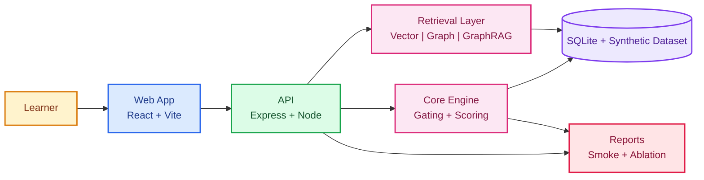

# OmniMentor

Learning Solution for evidence-first engineering decision making.

<p align="left">
	<a href="docs/00-overview.md"></a>
	<a href="docs/01-requirements.md"></a>
	<a href="docs/architecture.md"></a>
	<a href="docs/03-api-contract.md"></a>
	<a href="docs/04-data-model.md"></a>
	<a href="docs/05-development-setup.md"></a>
	<a href="docs/06-testing-strategy.md"></a>
	<a href="docs/07-verification-and-quality-gates.md"></a>
	<a href="docs/09-operations-runbook.md"></a>
</p>

OmniMentor is a learning solution that trains evidence-first engineering judgment.
It helps learners practice decisions that matter in real delivery work: ownership routing, dependency reasoning, blast-radius thinking, and clear evidence-backed justification.

This project is currently designed for local single-user use on macOS first, and is planned to expand to additional platforms later.
It is open source only, has no paid version, does not use telemetry, and does not send user data to external services.

## At A Glance

| Focus Area | Why It Matters |
|---|---|
| Evidence-first decision training | Builds defensible engineering judgment, not guesswork |
| Transparent scoring | Learners can see exactly what improved or failed |
| Repeatable verification | Outcomes are backed by commands and artifacts |
| Scenario-based flow | Practice mirrors real operational decision-making |

## Why This Exists

Engineering teams lose time and reliability when decisions are based on opinion instead of evidence.
OmniMentor addresses this gap with scenario-based practice that evaluates:
- ownership routing
- dependency impact reasoning
- blast-radius analysis
- evidence-backed justification

The result is practical training that improves decision quality in real engineering work.

## What Makes It Useful

- Evidence gating catches unsupported claims early.
- Scoring is transparent: feedback explains why a submission passed or failed.
- Evaluation is reproducible through repeatable scripts and machine-readable outputs.
- The same flow can be run consistently across scenarios and retrieval modes.

## Core Capabilities

- Scenario workflow from prompt to scored feedback.
- Rubric-based scoring with explicit metrics.
- Retrieval mode comparisons for evaluation depth.
- Machine-readable output artifacts for auditability.

## High-Level Architecture



See `docs/architecture.md` for full architecture and detailed flow.

## Current Scope

This repository delivers a working end-to-end baseline:
- React web interface for scenario interaction.
- Express API for submissions, scoring, and evaluation jobs.
- Core scoring engine for evidence gating and rubric metrics.
- Evaluation scripts that generate JSON and CSV reports.

## Proposal Focus

This implementation stays aligned with the proposal baseline and keeps changes measurable through tests, runtime checks, and generated reports.

## Quick Start

### Prerequisites

- Git
- Node.js 20+
- pnpm
- sqlite3

macOS setup:

```bash
brew update
brew install git node pnpm sqlite
```

### Install

```bash
git clone https://github.com/asharma3084/OmniMentor-Learning-Solution.git
cd OmniMentor-Learning-Solution
pnpm install
cp config/.env.example .env
```

### Run

```bash
pnpm --filter @omnimentor/api dev
pnpm --filter @omnimentor/web dev
```

Health checks:

```bash
curl -s http://localhost:3001/
curl -s http://localhost:3001/health
```

## Quality Gates

These commands give objective proof that the system is healthy end-to-end.

```bash
pnpm lint
pnpm test
pnpm typecheck
pnpm build
pnpm smoke
pnpm eval
pnpm audit
```

## API Endpoints

- `GET /`
- `GET /health`
- `GET /scenarios`
- `GET /scenarios/:id`
- `GET /evidence?scenarioId=:id`
- `POST /submissions`
- `POST /score`
- `POST /ablation/run`

## Evaluation Modes

- `vector`
- `graph`
- `graphrag`
- `graphrag_gating`

## Output Artifacts

- `reports/week1/smoke-*.json`
- `services/api/reports/week1/ablation-run-*.json`
- `services/api/reports/week1/ablation-summary.csv`

## Data And Security Policy

- Synthetic-only learning artifacts.
- No personal or company-internal data.
- No secrets committed to source control.

## Documentation

- [`docs/README.md`](docs/README.md) (documentation index)
- [`docs/00-overview.md`](docs/00-overview.md)
- [`docs/01-requirements.md`](docs/01-requirements.md)
- [`docs/architecture.md`](docs/architecture.md) (full detailed architecture)
- [`docs/03-api-contract.md`](docs/03-api-contract.md)
- [`docs/04-data-model.md`](docs/04-data-model.md)
- [`docs/05-development-setup.md`](docs/05-development-setup.md)
- [`docs/06-testing-strategy.md`](docs/06-testing-strategy.md)
- [`docs/07-verification-and-quality-gates.md`](docs/07-verification-and-quality-gates.md)
- [`docs/08-release-and-deployment.md`](docs/08-release-and-deployment.md)
- [`docs/09-operations-runbook.md`](docs/09-operations-runbook.md)
- [`docs/10-security-and-compliance.md`](docs/10-security-and-compliance.md)
- [`docs/11-decisions-log.md`](docs/11-decisions-log.md)
