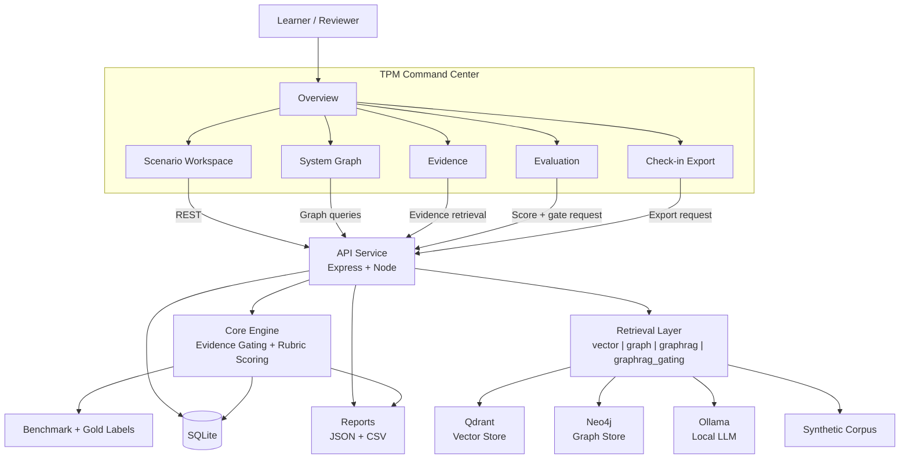

<div align="center">

# 🎓 OmniMentor

### From Architecture Blindness to Architectural Fluency.
#### The Intelligence Platform for Better Decisions.

[](config/vitest.config.ts)
[](apps/web/tsconfig.json)
[](docs/architecture.md)
[](docs/05-development-setup.md)
[](LICENSE)

<p>
  <a href="docs/00-overview.md"></a>
  <a href="docs/architecture.md"></a>
  <a href="docs/03-api-contract.md"></a>
  <a href="docs/05-development-setup.md"></a>
  <a href="docs/07-verification-and-quality-gates.md"></a>
  <a href="docs/10-security-and-compliance.md"></a>
</p>

</div>

---

At Omni-Mart, engineers and TPMs entering a new domain find that the system's real logic — who owns what, what depends on what, and what breaks if you touch it — lives in tribal memory, not documentation. A new joiner puts work into a service change, only to discover a hidden upstream dependency requiring a completely different configuration. By then, you are looking at expensive rework, delayed delivery, and a confidence hit that takes weeks to recover from.

**OmniMentor treats this as a learning problem, not a documentation problem.**

It provides a practice environment to build evidence-first reasoning before those decisions cost anything in production. Pick a realistic scenario. Inspect the evidence. Submit your analysis. Receive rubric-based feedback tied to what was missing and why it matters. Repeat until evidence-first thinking is the default — not something triggered only by a post-mortem.

> *"A newcomer should be able to sit in a meeting, explain the key dependencies, and predict how a change might ripple through the system — with confidence, before things go wrong."*

---

## What It Addresses

| Dimension | The Problem | How OmniMentor Helps |
|---|---|---|
| **Cognitive Load** | Mental energy consumed by basic fact retrieval — who owns this? what does this touch? — instead of high-level reasoning | Architecture externalised so engineers reason visually, not from memory |
| **Emotional Anxiety** | Fear of bothering a senior engineer. Hesitation to lead a system review. Uncertainty that slows decisions. | Non-judgmental, always-available practice with traceable, verifiable answers |
| **Social Isolation** | Ownership knowledge lives with people who were there. Newcomers navigate blind across team boundaries. | Ownership, dependencies, and coordination boundaries made explicit and queryable |

---

## Quick Start

**Prerequisites**: Node.js 20+, pnpm, macOS

```bash
git clone https://github.com/asharma3084/OmniMentor-Learning-Platform.git
cd OmniMentor-Learning-Platform
pnpm --dir workspace install
bash scripts/manage.sh start all
```

**Health check:**
```bash
curl -s http://localhost:3001/health
```

Web UI → [http://localhost:5173](http://localhost:5173) · API → [http://localhost:3001](http://localhost:3001)

---

## How It Works

OmniMentor runs a **scenario-based practice loop** grounded in cognitive apprenticeship (Collins et al., 1989), scaffolding theory (Wood et al., 1976), and self-explanation (Chi et al., 1989):

1. **Select a scenario** — a realistic operational prompt from the synthetic Omni-Mart corpus
2. **Inspect the evidence** — ownership records, dependency traces, runbooks, incident notes, policy artefacts
3. **Submit your analysis** — owner routing, dependency trace (upstream → downstream), blast-radius plan, evidence notes
4. **Receive rubric feedback** — score, critical-error flags, gold-aligned explanation of what was missing and why it matters

The feedback engine evaluates five dimensions:

| Metric | What It Measures |
|---|---|
| Owner-routing accuracy | Did you identify the correct primary owner and escalation path? |
| Dependency-trace accuracy | Is the upstream → downstream critical path correct? |
| Blast-radius completeness | Did the plan explicitly state downstream impacts and constraints? |
| Evidence relevance score | Coverage against the gold evidence set (primary + corroborating required) |
| Unsupported-claim rate | Proportion of submitted claims not backed by opened evidence |

Critical errors — wrong owner, wrong directionality, unsafe action without verification — are flagged explicitly.

---

## Architecture



See [`docs/architecture.md`](docs/architecture.md) for full architecture, sequence diagrams, and component responsibilities.

---

## Evaluation Design

Reproducible ablation study across four retrieval modes against a gold-labeled benchmark of 12 scenarios across three domains: Catalog, Cart & Checkout, Risk & Compliance.

| Mode | What it does |
|---|---|
| `vector` | Top-k vector retrieval via Qdrant |
| `graph` | 1–3 hop graph traversal via Neo4j + APOC |
| `graphrag` | Graph-grounded retrieval context assembly |
| `graphrag_gating` | GraphRAG + claim-level evidence gating |

TPM Command Center tabs:
- `Overview`
- `Scenario Workspace`
- `System Graph`
- `Evidence`
- `Evaluation`
- `Check-in Export`

A+ freeze-scope enhancements (design/architecture baseline before coding completion):
- `System Graph`: interactive node-edge canvas with zoom, pan, filters, path highlighting, and provenance-linked node detail.
- `Evaluation`: richer per-mode analytics (table + trend deltas + error-category breakdown) with clear mode diagnostics.
- `Check-in Export`: structured mentor-ready export with evidence links, score/gating snapshot, and copy/download actions.

---

## Quality Gates

```bash
pnpm --dir workspace lint        # zero warnings
pnpm --dir workspace typecheck   # strict TypeScript
pnpm --dir workspace test        # 20 tests across 4 suites
pnpm --dir workspace build       # clean production build
pnpm --dir workspace smoke       # end-to-end health check
pnpm --dir workspace eval        # benchmark + ablation report
```

All gates must pass before any change is considered done.

---

## API

```
GET  /health
GET  /scenarios
GET  /scenarios/:id
GET  /evidence?scenarioId=:id
POST /submissions
POST /score
POST /ablation/run
```

Full contract: [`docs/03-api-contract.md`](docs/03-api-contract.md)

---

## Data and Security

- Synthetic-only corpus. No personal, proprietary, or company-internal data.
- No secrets committed to source control.
- No telemetry. No external data transmission.

---

## Documentation

| Doc | Contents |
|---|---|
| [`docs/architecture.md`](docs/architecture.md) | Full system design, diagrams, component responsibilities |
| [`docs/detailed-ui-design.md`](docs/detailed-ui-design.md) | Detailed UI architecture, page contracts, and mockups |
| [`docs/00-overview.md`](docs/00-overview.md) | Project overview and scope |
| [`docs/01-requirements.md`](docs/01-requirements.md) | Functional and non-functional requirements |
| [`docs/03-api-contract.md`](docs/03-api-contract.md) | API endpoint contract and response shapes |
| [`docs/04-data-model.md`](docs/04-data-model.md) | Logical data model |
| [`docs/05-development-setup.md`](docs/05-development-setup.md) | Local development setup |
| [`docs/06-testing-strategy.md`](docs/06-testing-strategy.md) | Test pyramid and strategy |
| [`docs/07-verification-and-quality-gates.md`](docs/07-verification-and-quality-gates.md) | Quality gate commands and criteria |
| [`docs/10-security-and-compliance.md`](docs/10-security-and-compliance.md) | Security and data policy |
| [`docs/11-decisions-log.md`](docs/11-decisions-log.md) | Architecture and process decisions |
| [`docs/12-risks-and-technical-debt.md`](docs/12-risks-and-technical-debt.md) | Risks, fallbacks, and technical debt |

