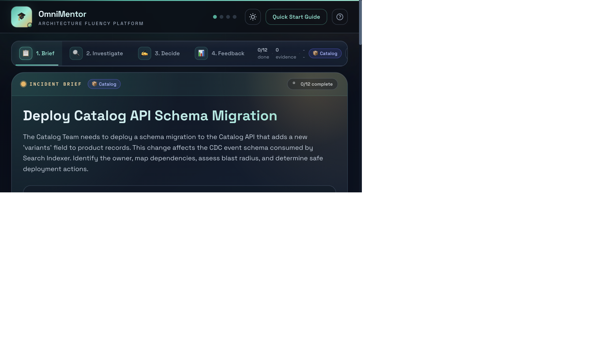
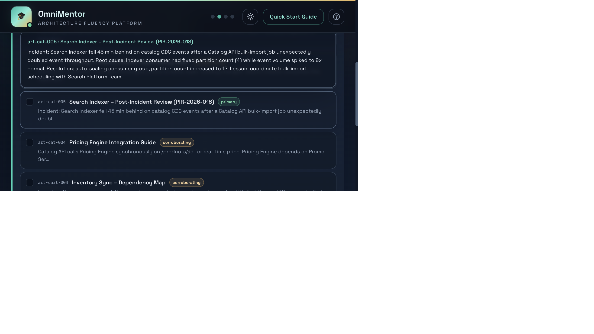
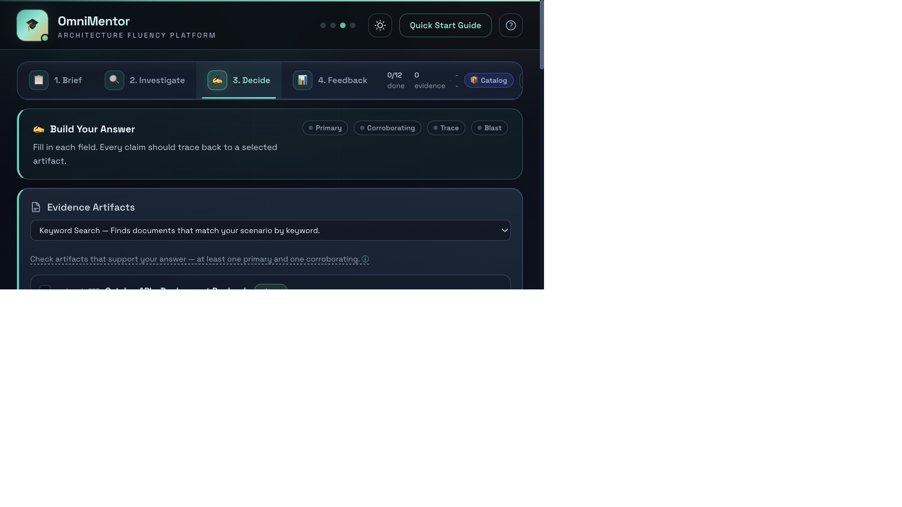
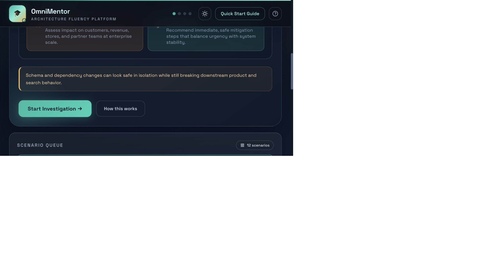
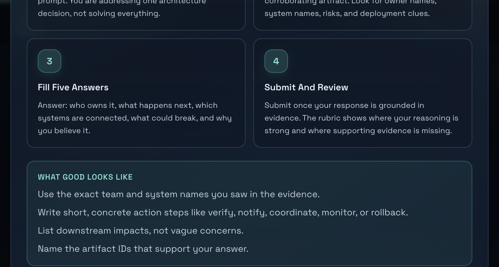
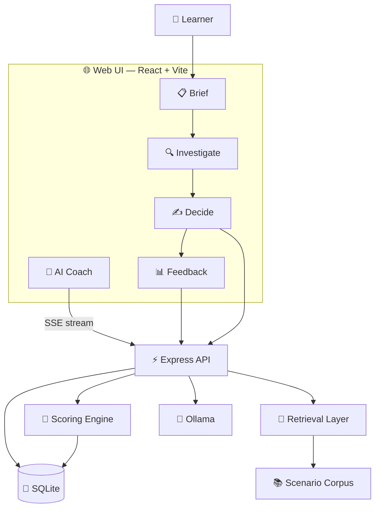

<!-- ═══════════════════════════════════════════════════════════════════════
     OmniMentor — Architecture Fluency Platform
     ═══════════════════════════════════════════════════════════════════════ -->

<div align="center">

<!-- Hero Banner -->
<picture>
  <source media="(prefers-color-scheme: dark)" srcset="https://capsule-render.vercel.app/api?type=waving&color=0:0a1628,50:1e3a5f,100:3b82f6&height=220&section=header&text=OmniMentor&fontSize=72&fontColor=ffffff&fontAlignY=35&desc=Architecture%20Fluency%20Platform&descSize=20&descAlignY=55&descColor=94a3b8&animation=fadeIn" />
  <source media="(prefers-color-scheme: light)" srcset="https://capsule-render.vercel.app/api?type=waving&color=0:e0e7ff,50:818cf8,100:3b82f6&height=220&section=header&text=OmniMentor&fontSize=72&fontColor=1e1b4b&fontAlignY=35&desc=Architecture%20Fluency%20Platform&descSize=20&descAlignY=55&descColor=475569&animation=fadeIn" />
  
</picture>

<br/>

### Stop reading docs. Start building reasoning.

*The platform that teaches engineers and TPMs to think through distributed systems —*
*not just look things up.*

<br/>

[](LICENSE)
[](tsconfig.json)
[](tests/)
[](services/api/)
[](docs/reference/scenario-guide.md)

<br/>

<a href="docs/start-here/quickstart.md"></a>
&nbsp;&nbsp;
<a href="docs/start-here/overview.md"></a>
&nbsp;&nbsp;
<a href="docs/reference/scenario-guide.md"></a>

<br/><br/>

</div>

<!-- ═══════════ HERO SCREENSHOT ═══════════ -->

<div align="center">



<br/>

<sub>The Brief step — a realistic incident scenario from the synthetic Omni-Mart enterprise. Dark theme optimized for long practice sessions.</sub>

</div>

<br/>

---

<br/>

## The Problem

Your newest engineer joins the team. They're smart. Motivated. They have access to every wiki, every Confluence page, every architecture diagram.

**And they're still lost.**

They sit on an incident bridge unable to explain which service is failing, who owns it, or what might break next. The knowledge they need isn't in any document — it lives in the heads of people who've been there for years.

<br/>

<div align="center">

> **We call this *Architecture Blindness* — and it costs organizations millions in slow onboarding, repeated mistakes, and talent attrition.**

</div>

<br/>

<table>
<tr>
<td width="33%" align="center">

### 🧠 Cognitive Overload
Hundreds of microservices. Thousands of dependencies. No mental model to hold it together.

*Sweller, 1988*

</td>
<td width="33%" align="center">

### 😰 Performance Anxiety
Fear of asking "obvious" questions on a bridge call with 30 senior engineers listening.

*Bandura, 1977*

</td>
<td width="33%" align="center">

### 🏝️ Knowledge Silos
The real logic lives in tribal memory. Docs describe *what exists* — not *how to reason about it*.

*Lave & Wenger, 1991*

</td>
</tr>
</table>

<br/>

<div align="center">

**OmniMentor treats this as a *learning problem*, not a documentation problem.**

</div>

<br/>

---

<br/>

## How It Works

A four-step guided practice loop — grounded in cognitive science, not guesswork.

<br/>

<table>
<tr>
<td align="center" width="25%">


**📋 Read the Scenario**

A realistic incident drops. Understand the context, the stakes, and what decision you need to make.

<sub>Situated Cognition<br/>(Brown et al., 1989)</sub>

</td>
<td align="center" width="25%">


**🔍 Review Evidence**

Examine ownership registries, dependency specs, runbooks, and post-incident reviews. Select what matters.

<sub>Self-Explanation<br/>(Chi et al., 1989)</sub>

</td>
<td align="center" width="25%">


**✍️ Build Your Answer**

Route the owner. Trace the dependencies. Assess the blast radius. Cite your evidence.

<sub>Cognitive Apprenticeship<br/>(Collins et al., 1989)</sub>

</td>
<td align="center" width="25%">


**📊 Get Scored**

Five-dimension rubric with critical-error gates, coaching labels, and a connected learning summary.

<sub>Step-based Tutoring<br/>(VanLehn, 2011)</sub>

</td>
</tr>
</table>

<br/>

<div align="center">

💬 **AI Coach on every step** — powered by Ollama (`llama3.2`), running 100% on your machine. No data leaves your network.

</div>

<br/>

---

<br/>

## See It In Action

<br/>

<table>
<tr>
<td width="50%">



**Evidence Investigation** — Artifact cards with primary/corroborating classification. Learners select evidence before they can answer.

</td>
<td width="50%">



**Structured Decision** — Owner routing, dependency trace, blast radius assessment, and evidence notes. Every claim must be backed by an artifact.

</td>
</tr>
<tr>
<td width="50%">



**Scenario Queue** — 12 scenarios across 4 enterprise domains. Start any scenario and track your progress.

</td>
<td width="50%">



**Built-in Onboarding** — Interactive walkthrough teaches the practice loop before the first scenario.

</td>
</tr>
</table>

<br/>

---

<br/>

## What Makes It Different

<br/>

<table>
<tr>
<td width="50%">

### 🔒 Evidence Gating

Every claim in a learner's response must trace back to a specific artifact. Unsupported reasoning? Flagged immediately. No hand-waving allowed.

*This is how you build rigorous thinking — not just fast answers.*

</td>
<td width="50%">

### 🤖 AI That Coaches, Not Answers

The AI assistant has 8 behavioral guardrails. It nudges toward evidence. It asks Socratic questions. It never reveals the answer.

*A mentor that's always available — without the bottleneck.*

</td>
</tr>
<tr>
<td width="50%">

### 📊 Five-Dimension Rubric

Owner Routing · Dependency Trace · Blast Radius · Evidence Relevance · Unsupported Claims — each scored independently with coaching labels.

*Not a binary pass/fail. Granular feedback on exactly where reasoning breaks down.*

</td>
<td width="50%">

### 🏢 Enterprise-Grade Scenarios

12 realistic incidents across Catalog, Cart & Checkout, Risk & Compliance, and Fulfillment & Logistics. Built from real-world patterns at scale.

*Practice the complexity your team actually faces.*

</td>
</tr>
</table>

<br/>

---

<br/>

## Proven Results

Graph-augmented retrieval with evidence gating — validated across all 12 scenarios, 4 domains.

<br/>

<div align="center">

| Retrieval Mode | Accuracy | Improvement | |
|:---|:---:|:---:|:---|
| `vector` — Keyword Search | 0.856 | baseline | `████████░░` |
| `graph` — Connected Systems | 0.889 | +3.9% | `████████▉░` |
| `graphrag` — Deep Search | 0.930 | +8.6% | `█████████▎` |
| **`graphrag_gating`** — Deep + Validation | **0.963** | **+12.5%** | `██████████` |

</div>

<br/>

<div align="center">

> **+12.5% accuracy improvement** over baseline. Zero unsupported claims with evidence gating enabled.

</div>

<br/>

<table>
<tr>
<td align="center" width="25%">

**12**
<br/><sub>Scenarios</sub>

</td>
<td align="center" width="25%">

**4**
<br/><sub>Enterprise Domains</sub>

</td>
<td align="center" width="25%">

**0.963**
<br/><sub>Best Accuracy</sub>

</td>
<td align="center" width="25%">

**0**
<br/><sub>Unsupported Claims</sub>

</td>
</tr>
</table>

<br/>

---

<br/>

## Architecture



<br/>

<div align="center">


<br/><br/>

**TypeScript (strict)** · **React 18** · **Node.js 20+** · **Vite** · **SQLite** · **Express** · **Ollama** · **Playwright**

</div>

<br/>

---

<br/>

## Quick Start

```bash
# Clone
git clone https://github.com/arvisha16/OmniMentor-Learning-Platform-CS6460.git
cd OmniMentor-Learning-Platform-CS6460

# Install
pnpm --dir workspace install

# Launch
bash scripts/manage.sh start all
```

| Service | URL | Purpose |
|---|---|---|
| 🌐 Web UI | [localhost:9991](http://localhost:9991) | Practice interface |
| ⚡ API | [localhost:9992](http://localhost:9992) | Backend engine |

<br/>

**Requirements:** Node.js 20+ · pnpm · SQLite · Ollama (optional, for AI Coach)

<br/>

<details>
<summary><b>🧪 Run the test suite</b></summary>

```bash
pnpm --dir workspace lint        # Zero warnings
pnpm --dir workspace typecheck   # Strict TypeScript
pnpm --dir workspace test        # Unit tests
pnpm --dir workspace test:e2e    # 61 Playwright E2E tests
pnpm --dir workspace build       # Production build
pnpm --dir workspace eval        # Ablation benchmark
```

</details>

<details>
<summary><b>🔌 API Endpoints</b></summary>

```
GET  /health                    # Health check
GET  /scenarios                 # List all scenarios
GET  /scenarios/:id             # Scenario details
GET  /scenarios/:id/example-answer
GET  /evidence?scenarioId=:id   # Evidence for a scenario
POST /submissions               # Submit learner response
POST /score                     # Score a submission
POST /ablation/run              # Run ablation benchmark
POST /sessions/start            # Start learning session
POST /sessions/event            # Log session event
GET  /analytics/sessions        # Session analytics
POST /surveys                   # Submit survey
GET  /surveys                   # Get survey responses
POST /assist                    # AI coaching (streaming SSE)
```

Full schemas → [`docs/architecture/api-contract.md`](docs/architecture/api-contract.md)

</details>

<br/>

---

<br/>

## Security & Data

| | |
|:---:|:---|
| 🔒 | **100% synthetic data** — the Omni-Mart corpus contains zero real company information |
| 🛡️ | **No PII** — no personal data collected, stored, or transmitted |
| 🏠 | **Local-first** — AI runs on your machine via Ollama. Nothing leaves your network |
| 🔑 | **No secrets in source** — verified clean across all tracked files |

<br/>

---

<br/>

## Documentation

| | Resource | Description |
|:---:|:---|:---|
| 📖 | [Overview](docs/start-here/overview.md) | Problem framing and product vision |
| 🚀 | [Quickstart](docs/start-here/quickstart.md) | Setup and first run |
| 📘 | [User Guide](docs/start-here/user-guide.md) | Complete walkthrough for learners |
| 🏗️ | [System Architecture](docs/architecture/system-architecture.md) | Full system design |
| 📐 | [API Contract](docs/architecture/api-contract.md) | Endpoint schemas and examples |
| 🗃️ | [Data Model](docs/architecture/data-model.md) | Logical data model |
| 📋 | [Requirements](docs/architecture/requirements.md) | Functional & non-functional specs |
| 📝 | [Decisions Log](docs/architecture/decisions-log.md) | Architecture Decision Records |
| 📊 | [Evaluation & KPIs](docs/research/evaluation-and-kpis.md) | Research questions & metrics |
| 🧪 | [Testing Strategy](docs/research/testing-strategy.md) | Validation approach |
| 🎯 | [Scenario Guide](docs/reference/scenario-guide.md) | All 12 scenarios explained |
| 🎨 | [UI Design](docs/reference/detailed-ui-design.md) | Interface flows and mockups |

<br/>

---

<br/>

<div align="center">

### Built for the teams that move fast and break things — and the people who have to understand what broke.

<br/>

*Architecture fluency is a learnable skill. OmniMentor is how you practice it.*

<br/>

<a href="docs/start-here/quickstart.md"></a>

<br/><br/>

<sub>Created by <a href="https://github.com/arvisha16">Arvind Kumar Sharma</a></sub>

</div>

<!-- ═══════════ FOOTER WAVE ═══════════ -->

<picture>
  <source media="(prefers-color-scheme: dark)" srcset="https://capsule-render.vercel.app/api?type=waving&color=0:3b82f6,50:1e3a5f,100:0a1628&height=120&section=footer" />
  <source media="(prefers-color-scheme: light)" srcset="https://capsule-render.vercel.app/api?type=waving&color=0:3b82f6,50:818cf8,100:e0e7ff&height=120&section=footer" />
  
</picture>