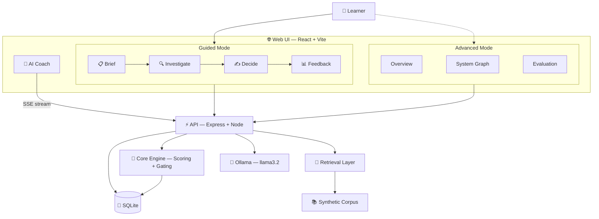

<div align="center">


# OmniMentor

### Turning Institutional Memory into a Learnable Skill

<br/>

[](docs/start-here/overview.md)
[](docs/start-here/overview.md)
[](docs/start-here/overview.md)
[-FFD600?style=for-the-badge)](docs/start-here/overview.md)

<br/>

<kbd>CS 6460 — Educational Technology</kbd> · <kbd>Georgia Institute of Technology</kbd> · <kbd>Spring 2026</kbd>

<br/>

<a href="docs/start-here/overview.md"></a>
<a href="docs/start-here/quickstart.md"></a>
<a href="docs/architecture/system-architecture.md"></a>
<a href="docs/reference/scenario-guide.md"></a>

<br/><br/>


<br/><br/>

</div>

---

## 💡 Why This Exists

I built OmniMentor because I've watched smart, motivated engineers freeze when they join a new team. Not because they lack skill — but because the system's real logic lives in tribal memory.

*Who owns this service? What breaks if you touch it? Who do you escalate to at 2am?*

None of that is in the docs. It's in someone's head. And that someone is always busy.

**This is Architecture Blindness**, and it hits on three levels:

<table>
<tr>
<td width="33%" align="center">

### 🧠 Cognitive

Too many services, too many names — no mental model for what owns what

</td>
<td width="33%" align="center">

### 😰 Emotional

Fear of asking "obvious" questions. Hesitation to make calls under uncertainty

</td>
<td width="33%" align="center">

### 🏝️ Social

Knowledge lives with people who were there. Newcomers navigate blind

</td>
</tr>
</table>

> **OmniMentor treats this as a learning problem, not a documentation problem.**
>
> *"A newcomer should be able to sit in a meeting, explain the key dependencies, and predict how a change might ripple through the system — with confidence, before things go wrong."*

---

## 🔄 How It Works

A four-step guided practice loop grounded in cognitive apprenticeship, scaffolding theory, and self-explanation research:

<table>
<tr>
<td align="center" width="25%">

### 📋 Step 1
**Brief**

Read the incident scenario, constraints, and what success looks like

</td>
<td align="center" width="25%">

### 🔍 Step 2
**Investigate**

Inspect evidence artifacts. Select primary + corroborating evidence

</td>
<td align="center" width="25%">

### ✍️ Step 3
**Decide**

Submit owner routing, dependency trace, blast radius, and evidence notes

</td>
<td align="center" width="25%">

### 📊 Step 4
**Feedback**

Rubric scores, critical-error flags, coaching, and gold-aligned explanation

</td>
</tr>
</table>

<div align="center">

💬 **AI Coach available on every step** — powered by Ollama (`llama3.2`), running 100% locally

</div>

The AI Assistant provides context-aware coaching without revealing answers. It nudges you toward evidence-first reasoning like a patient mentor would — not a search engine.

---

## 📊 What Gets Scored

Every submission is evaluated across **five rubric dimensions** with automated coaching:

| 🎯 Dimension | What It Measures |
|:---|:---|
| **Owner Routing** | Did you identify the correct primary owner with justification? |
| **Dependency Trace** | Is the upstream → downstream critical path accurate? |
| **Blast Radius** | Did you map downstream impacts and constraints? |
| **Evidence Relevance** | Coverage against gold evidence set (primary + corroborating) |
| **Unsupported Claims** | Any reasoning not backed by opened evidence? |

> ⚠️ Critical errors — wrong owner, inverted dependency direction, unsafe action without verification — trigger hard gates before scoring.

---

## 📈 Retrieval Ablation Results

Four retrieval modes tested across **12 scenarios** in **4 enterprise domains**:

<table>
<tr><td>

| Mode | Score | |
|:---|:---|:---|
| `vector` | 0.856 | `████████░░` |
| `graph` | 0.889 | `████████▉░` |
| `graphrag` | 0.930 | `█████████▎` |
| `graphrag_gating` | **0.963** | `██████████` |

</td><td>

**Domains covered:**
- 🛒 Catalog
- 🛍️ Cart & Checkout
- ⚖️ Risk & Compliance
- 🚚 Fulfillment & Logistics

**12 scenarios** · **61 E2E tests** · **All passing**

</td></tr>
</table>

> Monotonic improvement from baseline vector to evidence-gated GraphRAG — validated with reproducible ablation runs.

---

## 🏗️ Architecture



<details>
<summary><b>🔌 Full API Surface</b></summary>

```
GET  /health                    # Health check
GET  /scenarios                 # List all scenarios
GET  /scenarios/:id             # Scenario details
GET  /scenarios/:id/example-answer
GET  /evidence?scenarioId=:id   # Evidence for a scenario
POST /submissions               # Submit learner response
POST /score                     # Score a submission
POST /ablation/run              # Run ablation benchmark
POST /sessions/start            # Start learning session
POST /sessions/event            # Log session event
GET  /analytics/sessions        # Session analytics
POST /surveys                   # Submit survey
GET  /surveys                   # Get survey responses
GET  /surveys/status            # Survey completion status
POST /assist                    # AI coaching (streaming SSE)
```

See [`docs/architecture/api-contract.md`](docs/architecture/api-contract.md) for full schemas.

</details>

---

## 🚀 Getting Started

```bash
# Clone and install
git clone https://github.com/arvisha16/OmniMentor-Learning-Platform-CS6460.git
cd OmniMentor-Learning-Platform-CS6460
pnpm --dir workspace install

# Start everything
bash scripts/manage.sh start all

# Verify
curl -s http://localhost:9992/health
```

| | Service | URL |
|---|---|---|
| 🌐 | Web UI | [localhost:9991](http://localhost:9991) |
| ⚡ | API | [localhost:9992](http://localhost:9992) |

**Prerequisites:** Node.js 20+ · pnpm · SQLite · macOS · Ollama (for AI Coach)

---

## ✅ Quality Gates

```bash
pnpm --dir workspace lint        # Zero warnings
pnpm --dir workspace typecheck   # Strict TypeScript
pnpm --dir workspace test        # Unit tests
pnpm --dir workspace test:e2e    # 61 Playwright E2E tests
pnpm --dir workspace build       # Production build
pnpm --dir workspace eval        # Ablation benchmark
```

---

## 🔒 Data & Security

| | |
|---|---|
| ✅ | **Synthetic-only** corpus (Omni-Mart) — no real company data |
| ✅ | **No PII** — zero personal or production data |
| ✅ | **No secrets** committed to source control |
| ✅ | **No telemetry** — nothing leaves your machine |

---

## 🎓 Academic Foundation

This project stands on real learning science — not buzzwords.

<table>
<tr>
<td>

| Theory | Key Insight for OmniMentor |
|:---|:---|
| **Cognitive Load Theory** *(Sweller, 1988)* | Externalize architecture to free working memory |
| **Situated Cognition** *(Brown et al., 1989)* | Learning happens in authentic contexts, not textbooks |
| **Legitimate Peripheral Participation** *(Lave & Wenger, 1991)* | Newcomers learn by gradually doing real work |
| **Cognitive Apprenticeship** *(Collins et al., 1989)* | Guided practice with scaffolded feedback |
| **Self-Explanation** *(Chi et al., 1989)* | Articulating reasoning deepens understanding |
| **Design-Based Research** *(Barab & Squire, 2004)* | Build → test → iterate in authentic settings |

</td>
</tr>
</table>

---

## 📚 Documentation

<details>
<summary><b>📖 Full documentation index</b></summary>

| Doc | What's Inside |
|:---|:---|
| [Overview](docs/start-here/overview.md) | Project purpose and problem framing |
| [Quickstart](docs/start-here/quickstart.md) | Setup and first run |
| [User Guide](docs/start-here/user-guide.md) | Walkthrough for learners |
| [System Architecture](docs/architecture/system-architecture.md) | Full system design |
| [API Contract](docs/architecture/api-contract.md) | Endpoint schemas |
| [Data Model](docs/architecture/data-model.md) | Logical data model |
| [Requirements](docs/architecture/requirements.md) | Functional & non-functional |
| [Decisions Log](docs/architecture/decisions-log.md) | Architecture Decision Records |
| [Evaluation & KPIs](docs/research/evaluation-and-kpis.md) | Research questions & metrics |
| [Testing Strategy](docs/research/testing-strategy.md) | Validation approach |
| [Data & Security](docs/research/data-and-security.md) | Data handling posture |
| [Scenario Guide](docs/reference/scenario-guide.md) | All 12 scenarios explained |
| [UI Design](docs/reference/detailed-ui-design.md) | Tab flows and mockups |
| [Glossary](docs/reference/glossary.md) | Domain terminology |

</details>

---

## 🏆 Course Results

<div align="center">

| Assignment | Score | |
|:---|:---:|:---|
| Intermediate Milestone 1 | **9 / 10** | ⭐⭐⭐⭐⭐⭐⭐⭐⭐☆ |
| Intermediate Milestone 2 | **9 / 10** | ⭐⭐⭐⭐⭐⭐⭐⭐⭐☆ |
| Final Project | **10 / 10** | ⭐⭐⭐⭐⭐⭐⭐⭐⭐⭐ |
| Project Paper | **9 / 10** | ⭐⭐⭐⭐⭐⭐⭐⭐⭐☆ |
| Project Presentation | **9 / 10** | ⭐⭐⭐⭐⭐⭐⭐⭐⭐☆ |
| | | |
| **Total** | **46 / 50** | **92%** |

</div>

---

<div align="center">

**Built with ❤️ at Georgia Tech**

*Arvind Kumar Sharma · CS 6460 Educational Technology · Spring 2026*

<br/>

<a href="docs/start-here/quickstart.md"></a>

</div>

