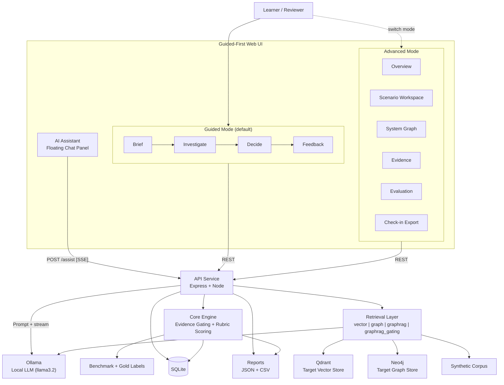

<div align="center">

# 🎓 OmniMentor Learning Platform

### *From Architecture Blindness to Architectural Fluency*

<br/>

> **CS 6460 — Educational Technology | Georgia Institute of Technology | Spring 2026**

<br/>

[](docs/assignments/project.md)
[](docs/assignments/project.md)
[](docs/assignments/project.md)
[-gold?style=for-the-badge&logo=award&logoColor=white)](docs/assignments/project.md)

<br/>

[](apps/web/tsconfig.json)
[](apps/web/package.json)
[](services/api/package.json)
[](docs/architecture/data-model.md)
[](services/api/src/index.ts)
[](tests/e2e/)
[](docs/start-here/quickstart.md)

<br/>

<p>
  <a href="docs/start-here/overview.md"></a>
  <a href="docs/start-here/quickstart.md"></a>
  <a href="docs/architecture/system-architecture.md"></a>
  <a href="docs/research/evaluation-and-kpis.md"></a>
  <a href="docs/reference/scenario-guide.md"></a>
</p>

</div>

---

## 🧠 The Problem

Enterprise software systems accumulate vast operational knowledge — ownership boundaries, dependency chains, runbook decisions, incident patterns — but this knowledge lives mostly in the heads of a few senior engineers. New joiners entering a domain find themselves unable to answer fundamental questions: *Who owns this service? What breaks if I change it? Who do I escalate to?*

We call this **Architecture Blindness** — and it operates across three reinforcing dimensions:

| 🔴 Dimension | 😰 The Problem | 💡 How OmniMentor Helps |
|---|---|---|
| **Cognitive Load** | Mental energy consumed by basic fact retrieval instead of high-level reasoning | Architecture externalized so engineers reason visually, not from memory |
| **Emotional Anxiety** | Fear of asking "obvious" questions; hesitation to lead system reviews | Non-judgmental, always-available practice with traceable, verifiable answers |
| **Social Isolation** | Ownership knowledge lives with people who were there; newcomers navigate blind | Ownership, dependencies, and coordination boundaries made explicit and queryable |

**OmniMentor treats this as a learning problem, not a documentation problem.**

> *"A newcomer should be able to sit in a meeting, explain the key dependencies, and predict how a change might ripple through the system — with confidence, before things go wrong."*

---

## 🚀 Quick Start

**Prerequisites**: Node.js 20+, pnpm, SQLite, macOS, Ollama (for AI Assistant)

```bash
git clone https://github.com/arvisha16/OmniMentor-Learning-Platform-CS6460.git
cd OmniMentor-Learning-Platform-CS6460
pnpm --dir workspace install
bash scripts/manage.sh start all
```

```bash
# Health check
curl -s http://localhost:9992/health
```

| Service | URL |
|---|---|
| 🌐 Web UI | [http://localhost:9991](http://localhost:9991) |
| ⚡ API | [http://localhost:9992](http://localhost:9992) |

**Start with the path that matches your role:**

| 👤 Role | 📄 Start Here |
|---|---|
| Reviewer / Mentor | [Overview](docs/start-here/overview.md) → [Quickstart](docs/start-here/quickstart.md) |
| Learner / TPM | [User Guide](docs/start-here/user-guide.md) |
| Technical Reviewer | [Architecture](docs/architecture/system-architecture.md) → [Evaluation](docs/research/evaluation-and-kpis.md) |

---

## 🔄 How It Works

OmniMentor defaults to a **guided-first practice loop** grounded in cognitive apprenticeship (Collins et al., 1989), scaffolding theory (Wood et al., 1976), and self-explanation (Chi et al., 1989):

```
┌─────────────────────────────────────────────────────────────────────┐
│                    🎯 Guided Learning Flow                          │
│                                                                     │
│  📋 Brief ──→ 🔍 Investigate ──→ ✍️ Decide ──→ 📊 Feedback        │
│                                                                     │
│  Read the      Inspect evidence,   Submit owner     Receive rubric  │
│  scenario &    select primary +    routing, deps,   feedback, flags │
│  constraints   corroborating       blast radius     & coaching      │
│                artifacts                                            │
└─────────────────────────────────────────────────────────────────────┘
                        💬 AI Assistant available at every step
```

🤖 An **AI Assistant** (chat bubble, bottom-right) is available on every step. Powered by **Ollama** running locally with `llama3.2`, it provides context-aware coaching — guiding you toward evidence-first reasoning without revealing gold-label answers.

### 📏 Five Scoring Dimensions

| Metric | What It Measures |
|---|---|
| Owner-routing accuracy | Did you identify the correct primary owner and escalation path? |
| Dependency-trace accuracy | Is the upstream → downstream critical path correct? |
| Blast-radius completeness | Did the plan explicitly state downstream impacts and constraints? |
| Evidence relevance score | Coverage against the gold evidence set (primary + corroborating required) |
| Unsupported-claim rate | Proportion of submitted claims not backed by opened evidence |

⚠️ Critical errors — wrong owner, wrong directionality, unsafe action without verification — are flagged explicitly.

---

## 📈 Ablation Results

Reproducible ablation study across **4 retrieval modes** × **12 scenarios** × **4 domains** (Catalog, Cart & Checkout, Risk & Compliance, Fulfillment & Logistics):

| Mode | Score | Progress |
|---|---|---|
| `vector` | 0.856 | 🟩🟩🟩🟩🟩🟩🟩🟩⬜⬜ |
| `graph` | 0.889 | 🟩🟩🟩🟩🟩🟩🟩🟩🟩⬜ |
| `graphrag` | 0.930 | 🟩🟩🟩🟩🟩🟩🟩🟩🟩⬜ |
| `graphrag_gating` | **0.963** | 🟩🟩🟩🟩🟩🟩🟩🟩🟩🟩 |

> Monotonic improvement from baseline vector (0.856) to evidence-gated GraphRAG (0.963), validated across 61 E2E tests.



See [`docs/architecture/system-architecture.md`](docs/architecture/system-architecture.md) for full architecture, sequence diagrams, and component responsibilities.

---

## ✅ Quality Gates

```bash
pnpm --dir workspace lint        # zero warnings
pnpm --dir workspace typecheck   # strict TypeScript
pnpm --dir workspace test        # unit tests
pnpm --dir workspace test:e2e    # 61 Playwright E2E tests
pnpm --dir workspace build       # clean production build
pnpm --dir workspace smoke       # end-to-end health check
pnpm --dir workspace eval        # benchmark + ablation report
```

---

## 🔌 API

```
GET  /health
GET  /scenarios
GET  /scenarios/:id
GET  /scenarios/:id/example-answer
GET  /evidence?scenarioId=:id
POST /submissions
POST /score
POST /ablation/run
POST /sessions/start
POST /sessions/event
GET  /analytics/sessions
POST /surveys
GET  /surveys
GET  /surveys/status
POST /assist              # AI coaching (streaming SSE, requires Ollama)
```

See [`docs/architecture/api-contract.md`](docs/architecture/api-contract.md) for full request/response schemas.

---

## 🔒 Data and Security

- ✅ Synthetic-only corpus (Omni-Mart). No personal, proprietary, or company-internal data.
- ✅ No secrets committed to source control.
- ✅ No telemetry. No external data transmission.
- ✅ No PII. No real production data.

---

## 📚 Documentation

Documentation hub: [`docs/README.md`](docs/README.md)

Recommended reading order:

1. [`docs/start-here/overview.md`](docs/start-here/overview.md)
2. [`docs/start-here/quickstart.md`](docs/start-here/quickstart.md)
3. [`docs/architecture/system-architecture.md`](docs/architecture/system-architecture.md)
4. [`docs/research/evaluation-and-kpis.md`](docs/research/evaluation-and-kpis.md)

Reference set:

| Doc | Contents |
|---|---|
| [`docs/start-here/user-guide.md`](docs/start-here/user-guide.md) | Practical usage guide for new, intermediate, and advanced TPMs |
| [`docs/architecture/requirements.md`](docs/architecture/requirements.md) | Functional and non-functional requirements |
| [`docs/architecture/api-contract.md`](docs/architecture/api-contract.md) | API endpoint contract and response shapes |
| [`docs/architecture/data-model.md`](docs/architecture/data-model.md) | Logical data model |
| [`docs/research/testing-strategy.md`](docs/research/testing-strategy.md) | Research and engineering validation strategy |
| [`docs/research/data-and-security.md`](docs/research/data-and-security.md) | Data handling and security posture |
| [`docs/architecture/decisions-log.md`](docs/architecture/decisions-log.md) | Architecture and process decisions |
| [`docs/reference/detailed-ui-design.md`](docs/reference/detailed-ui-design.md) | Detailed UI architecture and mockups |
| [`docs/reference/scenario-guide.md`](docs/reference/scenario-guide.md) | Current six-scenario walkthrough and demo guidance |
| [`docs/reference/risks-and-technical-debt.md`](docs/reference/risks-and-technical-debt.md) | Risks, fallbacks, and technical debt |
| [`docs/reference/glossary.md`](docs/reference/glossary.md) | Domain and product terminology |

---

## 🎓 Academic Foundation

OmniMentor is grounded in established learning science research:

| Theory | Author(s) | How It Informs OmniMentor |
|---|---|---|
| Cognitive Load Theory | Sweller, 1988 | Externalize architecture to reduce extraneous load |
| Situated Cognition | Brown, Collins & Duguid, 1989 | Authentic scenario-based practice |
| Legitimate Peripheral Participation | Lave & Wenger, 1991 | Progressive onboarding from observation to full participation |
| Cognitive Apprenticeship | Collins, Brown & Newman, 1989 | Guided practice with scaffolded feedback |
| Self-Explanation Effect | Chi et al., 1989 | Learner articulates reasoning before receiving feedback |
| Design-Based Research | Barab & Squire, 2004 | Iterative methodology; each milestone is a design cycle |

---

## 🏆 Course Results

| Assignment | Score | Date |
|---|---|---|
| Intermediate Milestone 1 | 9/10 | Mar 22, 2026 |
| Intermediate Milestone 2 | 9/10 | Apr 12, 2026 |
| Final Project | **10/10** | May 3, 2026 |
| Project Paper | 9/10 | May 3, 2026 |
| Project Presentation | 9/10 | May 3, 2026 |
| **Total** | **46/50 (92%)** | |

---

<div align="center">

*Built with ❤️ as a Georgia Tech CS 6460 capstone project*

*Arvind Kumar Sharma · Spring 2026*

</div>

