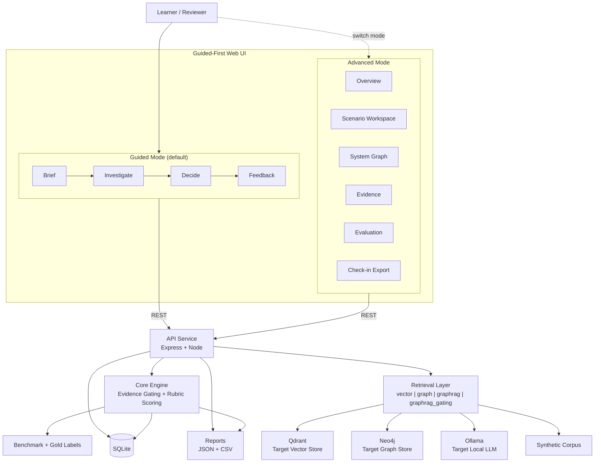

<div align="center">

# 🎓 OmniMentor

### From Architecture Blindness to Architectural Fluency.
#### The Intelligence Platform for Better Decisions.

[](config/vitest.config.ts)
[](apps/web/tsconfig.json)
[](docs/architecture/system-architecture.md)
[](docs/start-here/quickstart.md)
[](LICENSE)

<p>
  <a href="docs/README.md"></a>
  <a href="docs/start-here/overview.md"></a>
  <a href="docs/architecture/system-architecture.md"></a>
  <a href="docs/start-here/quickstart.md"></a>
  <a href="docs/research/evaluation-and-kpis.md"></a>
</p>

</div>

---

At Omni-Mart, engineers and TPMs entering a new domain find that the system's real logic — who owns what, what depends on what, and what breaks if you touch it — lives in tribal memory, not documentation. A new joiner puts work into a service change, only to discover a hidden upstream dependency requiring a completely different configuration. By then, you are looking at expensive rework, delayed delivery, and a confidence hit that takes weeks to recover from.

**OmniMentor treats this as a learning problem, not a documentation problem.**

It provides a practice environment to build evidence-first reasoning before those decisions cost anything in production. Pick a realistic scenario. Inspect the evidence. Submit your analysis. Receive rubric-based feedback tied to what was missing and why it matters. Repeat until evidence-first thinking is the default — not something triggered only by a post-mortem.

> *"A newcomer should be able to sit in a meeting, explain the key dependencies, and predict how a change might ripple through the system — with confidence, before things go wrong."*

---

## What It Addresses

| Dimension | The Problem | How OmniMentor Helps |
|---|---|---|
| **Cognitive Load** | Mental energy consumed by basic fact retrieval — who owns this? what does this touch? — instead of high-level reasoning | Architecture externalised so engineers reason visually, not from memory |
| **Emotional Anxiety** | Fear of bothering a senior engineer. Hesitation to lead a system review. Uncertainty that slows decisions. | Non-judgmental, always-available practice with traceable, verifiable answers |
| **Social Isolation** | Ownership knowledge lives with people who were there. Newcomers navigate blind across team boundaries. | Ownership, dependencies, and coordination boundaries made explicit and queryable |

---

## Quick Start

Start with the path that matches your role:

- Reviewer or mentor: [docs/start-here/overview.md](docs/start-here/overview.md) then [docs/start-here/quickstart.md](docs/start-here/quickstart.md)
- Learner or TPM: [docs/start-here/user-guide.md](docs/start-here/user-guide.md)
- Technical reviewer: [docs/architecture/system-architecture.md](docs/architecture/system-architecture.md) and [docs/research/evaluation-and-kpis.md](docs/research/evaluation-and-kpis.md)

**Prerequisites**: Node.js 20+, pnpm, sqlite, macOS

```bash
git clone https://github.com/asharma3084/OmniMentor-Learning-Platform.git
cd OmniMentor-Learning-Platform
pnpm --dir workspace install
bash scripts/manage.sh start all
```

**Health check:**
```bash
curl -s http://localhost:9992/health
```

Web UI → [http://localhost:9991](http://localhost:9991) · API → [http://localhost:9992](http://localhost:9992)

---

## How It Works

OmniMentor now defaults to a **guided-first practice loop** grounded in cognitive apprenticeship (Collins et al., 1989), scaffolding theory (Wood et al., 1976), and self-explanation (Chi et al., 1989):

1. **Brief** — read the mission, constraints, and success criteria for one scenario
2. **Investigate** — inspect evidence, extract owner/dependency/risk clues, and select one primary plus one corroborating artifact
3. **Decide** — submit owner routing, dependency trace (upstream → downstream), action plan, blast radius, and evidence notes
4. **Feedback** — receive rubric feedback, critical-error flags, and gold-aligned explanation of what was missing and why it matters

The feedback engine evaluates five dimensions:

| Metric | What It Measures |
|---|---|
| Owner-routing accuracy | Did you identify the correct primary owner and escalation path? |
| Dependency-trace accuracy | Is the upstream → downstream critical path correct? |
| Blast-radius completeness | Did the plan explicitly state downstream impacts and constraints? |
| Evidence relevance score | Coverage against the gold evidence set (primary + corroborating required) |
| Unsupported-claim rate | Proportion of submitted claims not backed by opened evidence |

Critical errors — wrong owner, wrong directionality, unsafe action without verification — are flagged explicitly.

---

## Architecture



See [`docs/architecture/system-architecture.md`](docs/architecture/system-architecture.md) for full architecture, sequence diagrams, and component responsibilities.

---

## Evaluation Design

Reproducible ablation study across four retrieval modes against a gold-labeled benchmark of 6 scenarios across three domains: Catalog, Cart & Checkout, Risk & Compliance.

| Mode | Current Baseline | Target |
|---|---|---|
| `vector` | Keyword-overlap ranking (deterministic) | Top-k vector retrieval via Qdrant |
| `graph` | Keyword-overlap + dependency-term boosting | 1–3 hop graph traversal via Neo4j |
| `graphrag` | Keyword-overlap + dependency + provenance boosting | Graph-grounded retrieval context assembly |
| `graphrag_gating` | GraphRAG baseline + role-diversity enforcement + evidence gating | GraphRAG + claim-level evidence gating |

Advanced mode review surfaces:
- `Overview`
- `Scenario Workspace`
- `System Graph`
- `Evidence`
- `Evaluation`
- `Check-in Export`

Freeze-scope enhancements (design/architecture baseline before coding completion):
- `System Graph`: interactive review surface with filters, node focus, path review, and provenance-linked node detail.
- `Evaluation`: richer per-mode analytics (table + trend deltas + error-category breakdown) with clear mode diagnostics.
- `Check-in Export`: structured review-ready export with selected-evidence references, score/gating snapshot, and copy/download actions.

---

## Quality Gates

```bash
pnpm --dir workspace lint        # zero warnings
pnpm --dir workspace typecheck   # strict TypeScript
pnpm --dir workspace test        # 28 tests across 5 suites
pnpm --dir workspace test:e2e    # guided GUI automation on isolated ports
pnpm --dir workspace build       # clean production build
pnpm --dir workspace smoke       # end-to-end health check
pnpm --dir workspace eval        # benchmark + ablation report
```

All gates must pass before any change is considered done.

---

## API

```
GET  /health
GET  /scenarios
GET  /scenarios/:id
GET  /scenarios/:id/example-answer
GET  /evidence?scenarioId=:id
POST /submissions
POST /score
POST /ablation/run
POST /sessions/start
POST /sessions/event
GET  /analytics/sessions
POST /surveys
GET  /surveys
GET  /surveys/status
```

See [`docs/architecture/api-contract.md`](docs/architecture/api-contract.md) for the complete API contract with request/response schemas.

Full contract: [`docs/architecture/api-contract.md`](docs/architecture/api-contract.md)

---

## Data and Security

- Synthetic-only corpus. No personal, proprietary, or company-internal data.
- No secrets committed to source control.
- No telemetry. No external data transmission.

---

## Documentation

Documentation hub: [`docs/README.md`](docs/README.md)

Recommended reading order:

1. [`docs/start-here/overview.md`](docs/start-here/overview.md)
2. [`docs/start-here/quickstart.md`](docs/start-here/quickstart.md)
3. [`docs/architecture/system-architecture.md`](docs/architecture/system-architecture.md)
4. [`docs/research/evaluation-and-kpis.md`](docs/research/evaluation-and-kpis.md)

Reference set:

| Doc | Contents |
|---|---|
| [`docs/start-here/user-guide.md`](docs/start-here/user-guide.md) | Practical usage guide for new, intermediate, and advanced TPMs |
| [`docs/architecture/requirements.md`](docs/architecture/requirements.md) | Functional and non-functional requirements |
| [`docs/architecture/api-contract.md`](docs/architecture/api-contract.md) | API endpoint contract and response shapes |
| [`docs/architecture/data-model.md`](docs/architecture/data-model.md) | Logical data model |
| [`docs/research/testing-strategy.md`](docs/research/testing-strategy.md) | Research and engineering validation strategy |
| [`docs/research/data-and-security.md`](docs/research/data-and-security.md) | Data handling and security posture |
| [`docs/architecture/decisions-log.md`](docs/architecture/decisions-log.md) | Architecture and process decisions |
| [`docs/reference/detailed-ui-design.md`](docs/reference/detailed-ui-design.md) | Detailed UI architecture and mockups |
| [`docs/reference/scenario-guide.md`](docs/reference/scenario-guide.md) | Current six-scenario walkthrough and demo guidance |
| [`docs/reference/risks-and-technical-debt.md`](docs/reference/risks-and-technical-debt.md) | Risks, fallbacks, and technical debt |
| [`docs/reference/glossary.md`](docs/reference/glossary.md) | Domain and product terminology |

