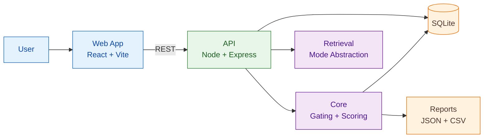
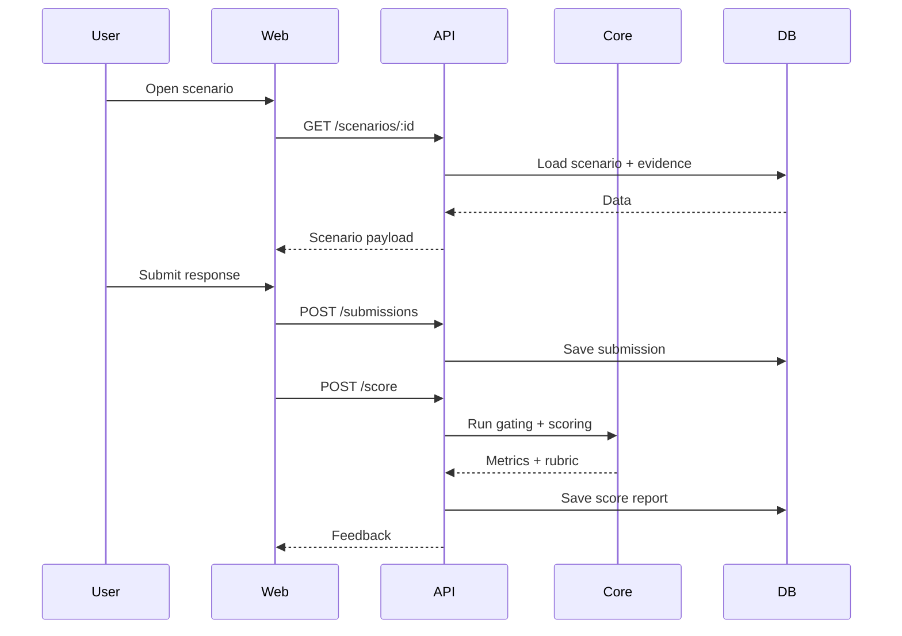

# OmniMentor Architecture (Presentation Version)

Version: 1.0
Audience: class presentation, live demo, quick technical review

## 1. One-Slide Summary

OmniMentor is a proposal-aligned learning system where users solve scenarios, cite evidence, submit structured reasoning, and receive transparent rubric feedback.

Core value:
- Evidence-first decision making
- Measurable rubric scoring
- Reproducible evaluation artifacts

## 2. System Map



## 3. Flow A (Demo Narrative)



## 4. Evaluation Modes (Ablation)

- `vector`
- `graph`
- `graphrag`
- `graphrag_gating`

Each run outputs:
- JSON report (`ablation-run-*.json`)
- CSV summary row (`ablation-summary.csv`)

## 5. Live Demo Script (60-90 seconds)

1. Show API root and health:
   - `GET /`
   - `GET /health`
2. Open scenario in web app and explain evidence panel.
3. Submit structured response.
4. Show scoring feedback and gating outcome.
5. Show generated smoke/eval artifacts.

## 6. Quality Proof Slide

Run these commands:

```bash
pnpm lint
pnpm test
pnpm typecheck
pnpm build
pnpm smoke
pnpm eval
pnpm audit
```

What this proves:
- code quality
- test correctness
- runtime success
- reproducible evaluation
- dependency hygiene

## 7. Proposal Alignment Statement

This implementation follows proposal scope as baseline.
If any scope deviation occurs, it is:
1. logged in local session notes
2. evidenced in generated report artifacts
3. disclosed in the weekly status check
