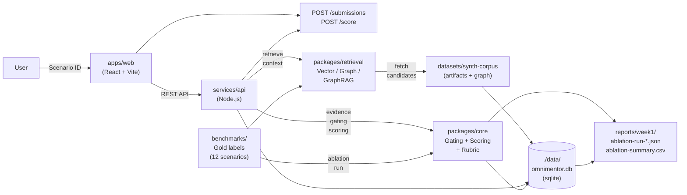

# OmniMentor — Architecture & Design

**Version**: 1.0 (Phase 1)
**Last Updated**: 2026-03-07

## System Overview

OmniMentor is a scenario-based onboarding deliberate-practice application that evaluates user submissions against rubric-based scoring, evidence gating, and gold-labeled benchmarks. The system supports multiple retrieval modes to investigate the impact of evidence-driven feedback on learning outcomes.

## Data Flow Diagram



## Layers & Responsibilities

### 1. **User Interface Layer** (`/apps/web`)

- React component tree (Vite bundler)
- Scenario list view
- Evidence panel (displays artifacts, checkboxes for primary/corroborating)
- Submission form (owner routing, dependency trace, action plan, blast radius, evidence notes)
- Feedback display (rubric scores, critical errors, explanations)

**Key components**:
- `ScenarioView` — displays prompt, artifact list
- `EvidencePanel` — evidence selection + citation
- `SubmissionForm` — structured data entry
- `FeedbackView` — score breakdown + explanations

### 2. **API Layer** (`/services/api`)

REST endpoints (Node.js + Express or similar):

#### Health & Metadata
- `GET /health` — liveness probe
- `GET /scenarios` — list all scenarios
- `GET /scenarios/:id` — fetch single scenario + artifacts

#### Evidence & Retrieval (stub in Phase 1)
- `GET /evidence?scenarioId=:id` — fetch candidate evidence (Phase 2+: retrieval modes)

#### Submission & Scoring
- `POST /submissions` — persist user submission
  - Request: `{ scenarioId, ownerRouting, dependencyTrace, actionPlan, blastRadius, evidenceNotes, selectedEvidenceIds }`
  - Response: `{ submissionId, createdAt, sqlite_row_id }`
- `POST /score` — gate + score submission
  - Request: `{ submissionId }`
  - Response: `{ reportId, ownerRoutingScore, dependencytracyScore, blastRadiusScore, evidenceRelevance, unsupportedClaimCount, criticalErrorCount, rubricBreakdown, explanations, goldCompare }`

#### Ablation & Benchmark
- `POST /ablation/run` — run benchmark across all modes
  - Request: `{ modes: ["vector", "graph", "graphrag", "graphrag_gating"] }` (Phase 1: scaffold)
  - Response: `{ runId, mode, results_json_path, csv_row }`

### 3. **Core Business Logic** (`/packages/core`)

Pure functions (unit-testable, no I/O):

#### Parsing & Claim Units
- `parseClaimUnits(text)` → `{ claimId, sentence, keywords, confidence }`
  - Splits response into sentence-level claims
  - Extracts key terms for matching against evidence

#### Evidence Gating
- `checkClaimSupport(claim, selectedEvidenceIds, goldEvidenceMap)` → `{ supported: bool, citedEvidenceIds, matchGold: bool }`
  - Validates if claim is cited by **primary** or **corroborating** evidence
  - Checks against gold evidence set
  - Returns critical error if unsupported

#### Scoring & Rubric
- `scoreOwnerRouting(submission, goldOwner)` → `{ correct: bool, score: 0-1 }`
- `scoreDependencyTrace(edges, goldEdges)` → `{ accuracy: 0-1, directionality_correct: bool }`
- `scoreBlastRadius(actionIds, goldSafeActions)` → `{ completeness: 0-1, quality: 0-1 }`
- `aggregateMetrics(claims, gatingResults, rubricScores)` → `{ overall: 0-1, breakdown: {...} }`

#### Interfaces

```typescript
interface Claim {
  id: string;
  text: string;
  startIdx: number;
  endIdx: number;
}

interface Evidence {
  id: string;
  title: string;
  body: string;
  role: "primary" | "corroborating" | "reference";
}

interface GatingPolicy {
  requirePrimary: boolean;
  allowCorroborating: boolean;
  goldEvidenceThreshold: number; // 0.0-1.0
}

interface RubricScore {
  criterion: string;
  score: number;
  explanation: string;
}

interface SubmissionResult {
  submissionId: string;
  gatingPass: boolean;
  criticalErrors: string[];
  rubricScores: RubricScore[];
  metrics: {
    ownerAccuracy: number;
    dependencyAccuracy: number;
    blastRadiusCompleteness: number;
    evidenceRelevance: number;
    unsupportedClaimRate: number;
  };
}
```

### 4. **Retrieval Layer** (`/packages/retrieval`)

Pluggable retrieval modes:

#### Interface
```typescript
interface Retriever {
  retrieve(scenarioId: string, query: string, topK: number): Promise<Evidence[]>;
}

interface ContextBuilder {
  buildContext(scenario: Scenario, selectedEvidenceIds: string[]): Promise<string>;
}
```

#### Phase 1 Implementations (Stub)
- `VectorRetriever` — placeholder (Phase 2)
- `GraphRetriever` — placeholder (Phase 2)
- `GraphRAGRetriever` — placeholder (Phase 2)

#### Phase 2+ Implementations
- **Vector-only**: Embed artifacts; cosine similarity top-K retrieval
- **Graph-only**: Traverse edges (BFS/DFS, bounded depth) from scenario node
- **GraphRAG**: Combine graph + context assembly (LLM + artifacts)
- **GraphRAG + Gating**: GraphRAG context + evidence policy enforcement

### 5. **Benchmark & Evaluation** (`/benchmarks`)

#### Gold Labels (per scenario)

```typescript
interface ScenarioBenchmark {
  id: string;
  prompt: string;
  goldOwner: string;
  goldDependencyTrace: { from: string; to: string; type: "upstream" | "downstream" }[];
  goldSafeActions: string[];
  goldRequiredEvidenceIds: string[]; // claims must cite these
  rubricExplanations: string;
}
```

#### Ablation Runner (`scripts/eval_run.ts`)

For each scenario, for each mode:
1. Fetch scenario + artifacts
2. Run retriever (get candidate evidence)
3. (Phase 2+) Generate submission via LLM
4. Score submission
5. Aggregate metrics

Output:
- **JSON**: `{ scenario, mode, metrics, timestamp }`
- **CSV row**: `scenario_id,mode,owner_accuracy,dependency_accuracy,...`

### 6. **Persistence** (`/data`)

#### SQLite Schema (Phase 1)

```sql
CREATE TABLE scenarios (
  id TEXT PRIMARY KEY,
  title TEXT,
  prompt TEXT,
  artifacts JSONB,
  created_at TIMESTAMP
);

CREATE TABLE submissions (
  id TEXT PRIMARY KEY,
  scenario_id TEXT REFERENCES scenarios(id),
  owner_routing TEXT,
  dependency_trace JSONB,
  action_plan TEXT,
  blast_radius JSONB,
  evidence_notes TEXT,
  selected_evidence_ids JSONB,
  created_at TIMESTAMP
);

CREATE TABLE score_reports (
  id TEXT PRIMARY KEY,
  submission_id TEXT REFERENCES submissions(id),
  gating_passed BOOLEAN,
  critical_errors JSONB,
  rubric_scores JSONB,
  metrics JSONB, -- { ownerAccuracy, dependencyAccuracy, ... }
  gold_comparison JSONB, -- { matches gold? }
  created_at TIMESTAMP
);

-- Phase 1+
CREATE TABLE ablation_runs (
  id TEXT PRIMARY KEY,
  mode TEXT, -- "vector", "graph", "graphrag", "graphrag_gating"
  scenario_id TEXT REFERENCES scenarios(id),
  metrics JSONB,
  created_at TIMESTAMP
);
```

---

## Flow A (Phase 1 Implementation Path)

### Step 1: User opens scenario
```
GET /scenarios/:id → Scenario object
```

### Step 2: User selects evidence
```
UI: render artifacts (primary/corroborating checkboxes)
```

### Step 3: User submits
```
POST /submissions → { submissionId, stored in DB }
```

### Step 4: Gating & Scoring
```
POST /score
  └─ parseClaimUnits(submission.text)
  └─ gateEvidenceClaims(claims, selectedEvidence)
  └─ scoreAgainstRubric(submission, goldLabels)
  └─ aggregateMetrics()
  └─ persist score_report
  └─ return feedback
```

### Step 5: Feedback Display
```
UI: show RubricScores, CriticalErrors, GoldComparison
```

---

## Test Strategy

### Unit Tests (`packages/core/`)
- Claim parsing edge cases
- Evidence gating logic (supported / unsupported / gold match)
- Rubric scoring examples
- Metrics aggregation

### Integration Tests (`__tests__/integration`)
- API → sqlite roundtrip (health → scenarios → submission → score → report)
- Evidence panel validation

### Smoke Test (`scripts/smoke.ts`)
- End-to-end: 1 scenario, human-like submission, gating + score, report file written

---

## Security & Data Policy

- **No secrets in code**: Use `.env` for API keys, DB paths, etc.
- **Input validation**: Validate POST bodies against schema (zod or similar)
- **CORS**: Restrict to localhost (development)
- **Rate limiting**: Basic token-bucket limiter on /score endpoint (Phase 1+)
- **Error handling**: Centralized error handler; never leak stack traces in non-dev responses

---

## Deployment (Phase 2+)

- **Local** (`deploy/local/`): docker-compose or manual dev setup
- **Enterprise** (`deploy/enterprise/`): Kubernetes/Helm overlay (not needed Phase 1)

---

## References

- **Master Instructions**: `2.OmniMentor_Copilot_Master_Instructions_W1.md`
- **Verification Log**: `VERIFICATION_LOG.md`
- **Context Continuity**: `PROJECT_CONTEXT.md`
