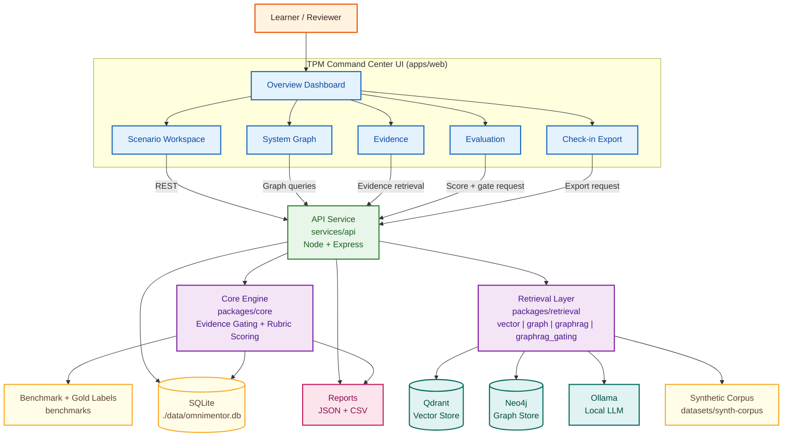
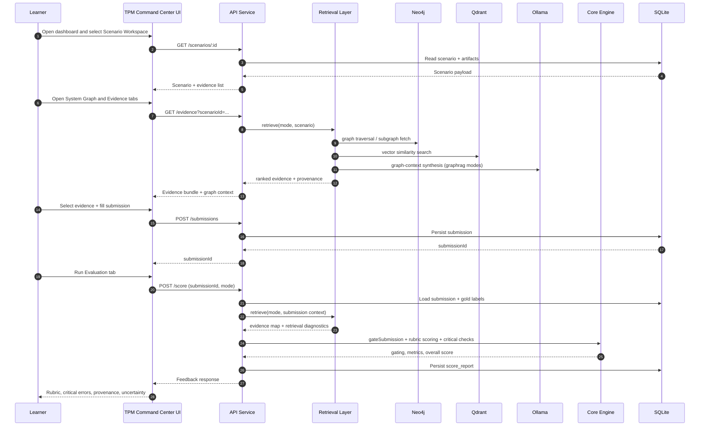
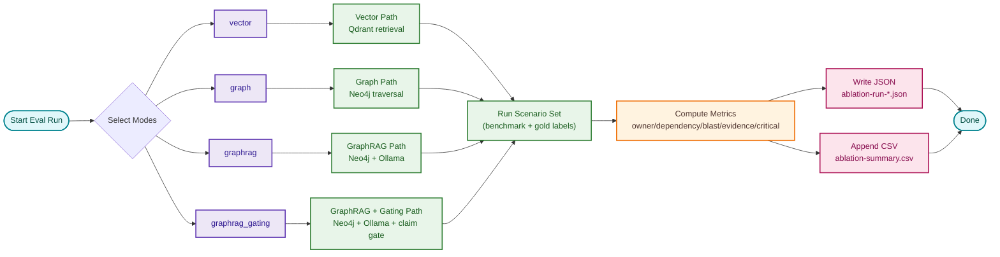

# OmniMentor Architecture

[](README.md) [](00-overview.md) [](01-requirements.md) [](architecture.md) [](07-verification-and-quality-gates.md) [](10-security-and-compliance.md)


Version: 2.7
Last Updated: 2026-03-09

## 1. Architecture Objectives

Per the approved project proposal and requirements docs, OmniMentor targets **Architecture Blindness**: the onboarding challenge where new engineers and TPMs struggle to navigate ownership, dependency direction, and governance constraints in complex systems.

The platform supports deliberate technical practice through:
- Scenario-based problem solving grounded in the synthetic Omni-Mart corpus.
- Evidence-first reasoning: learners must open, cite, and evaluate evidence before submitting claims.
- Claim-level gating: unsupported claims are flagged explicitly, not silently dropped.
- Rubric-driven scoring with transparent metrics and gold-standard comparison.
- Reproducible evaluation across four retrieval modes (ablation study design).

Source-of-truth references for this section:
- `docs/00-overview.md` (Problem and RQ framing)
- `docs/01-requirements.md` (functional/non-functional requirements)
- `personal/A4-QQ-SUBMIT.pdf` (qualifier-question framing)
- `personal/Project-Proposal-SUBMIT.pdf` (proposal baseline)

## 2. High-Level System Architecture

Canonical proposal-aligned stack:
- Vector store: Qdrant
- Graph store: Neo4j
- Graph retrieval: GraphRAG
- Local LLM: Ollama

The architecture below is proposal-aligned and consistent with `docs/detailed-ui-design.md`.



## 3. Flow A Runtime (Proposal Spine)

Flow A is the primary learning workflow.



## 4. Evaluation And Ablation Pipeline

This aligns to proposal requirement for mode comparison:
- `vector`
- `graph`
- `graphrag`
- `graphrag_gating`



## 5. Component Responsibilities

### 5.1 Web App (`apps/web`)
- Renders scenario prompts and evidence artifacts.
- Captures structured submission fields.
- Displays score, gating outcome, and rubric feedback.

### 5.1a Frontend Design Architecture
- Design intent: reduce Architecture Blindness by improving visual hierarchy, evidence discoverability, and feedback clarity.
- Visual system:
  - Typography: `Space Grotesk` (primary) + `IBM Plex Mono` (kicker/status labels).
  - Tokenized palette in CSS variables (`--bg-*`, `--surface-*`, `--text-*`, `--accent`, `--warn`, `--ok`, `--danger`).
  - Atmosphere: layered radial + linear gradients to separate product surface from ambient background.
- Interaction model:
  - Boot states: branded loading and explicit failure/retry screens.
  - Submission flow: progressive validation with inline messaging and disabled-state guardrails.
  - Score feedback: circular score ring + gating badge + critical-issue list.
- Motion model:
  - `revealUp` staggered section entry for first-load readability.
  - `floatPulse` subtle logo movement for brand presence without distraction.
- Responsive model:
  - Mobile-first single column.
  - Two-panel layout at large breakpoints (`lg:grid-cols-2`) for evidence/form parallel work.
- Result: GUI architecture is defined for a TPM-first onboarding command center with evidence-first reasoning and transparent feedback.

### 5.1b TPM Command Center UI Contract
- Post-login dashboard is the entry point with required tabs: `Overview`, `Scenario Workspace`, `System Graph`, `Evidence`, `Evaluation`, `Check-in Export`.
- Scenario Workspace enforces required structured fields: owner routing, dependency trace, blast-radius plan, evidence notes.
- Score surfaces must explicitly show critical error categories: wrong owner, wrong directionality, unsafe action without verification.
- Uncertainty and provenance are mandatory user-visible signals for trust design.
- System Graph is a first-class UI surface for Neo4j/GraphRAG node-edge navigation.
- AI assistant surface uses local Ollama guidance and remains bounded by evidence-gating policy.

### 5.1c Freeze-Scope Enhancements
- `System Graph` must provide interactive graph operations: zoom, pan, node/edge filtering, path tracing, and impact highlighting.
- `System Graph` node panel must show provenance-linked evidence and ownership/dependency metadata for selected graph entities.
- `Evaluation` must provide deeper mode analytics: per-mode metric table, deltas across modes, unsupported-claim trend, and critical-error category breakdown.
- `Evaluation` must expose mode diagnostics that explain retrieval behavior differences (`vector`, `graph`, `graphrag`, `graphrag_gating`).
- `Check-in Export` must generate review-ready summary output with scenario context, score/gating snapshot, evidence links, and copy/download actions.

### 5.2 API Service (`services/api`)
- Exposes REST contracts for scenario/evidence/submission/score/eval.
- Handles validation, persistence, and report generation.
- Coordinates core scoring and retrieval abstractions.

### 5.3 Core Engine (`packages/core`)
- Claim-unit parsing and evidence gating.
- Owner routing, dependency trace, blast radius scoring.
- Rubric construction and aggregate metrics.

### 5.4 Retrieval Layer (`packages/retrieval`)
- Pluggable retrieval interface for ablation modes.
- Canonical retrieval modes: `vector`, `graph`, `graphrag`, `graphrag_gating`.
- Graph retrieval and context assembly are architecturally tied to Neo4j/GraphRAG.
- LLM-augmented explanations are architecturally tied to Ollama, bounded by evidence-gating policy.

### 5.6 LLM And Graph Infrastructure (Canonical)
- **Ollama** is the local LLM provider for generation/explanation surfaces.
- **Neo4j** is the graph-of-record for ownership/dependency traversal.
- **Qdrant** is the vector retrieval store for semantic evidence lookup.
- **GraphRAG** composes graph and retrieval context before LLM assistance.

### 5.5 Data And Benchmarks
- Synthetic corpus in `datasets/synth-corpus`.
- Gold labels and benchmark definitions in `benchmarks`.
- Persistent runtime state in SQLite.

## 6. API Contract Summary

- `GET /`
- `GET /health`
- `GET /scenarios`
- `GET /scenarios/:id`
- `GET /evidence?scenarioId=:id`
- `POST /submissions`
- `POST /score`
- `POST /ablation/run`

## 7. Data Model (Logical)

### Scenario
- `id`, `title`, `prompt`, `artifacts[]`

### Submission
- `scenarioId`
- `ownerRouting`
- `dependencyTrace[]` (`from`, `to`, `type`)
- `actionPlan`
- `blastRadius[]`
- `evidenceNotes`
- `selectedEvidenceIds[]`

### Score Report
- `gatingPassed`
- `criticalErrors[]`
- `rubricScores`
- `metrics`
- `goldComparison`

### Ablation Output
- `runId`
- `mode`
- `scenarioId`
- `metrics`
- JSON + CSV artifacts

## 8. Quality And Reproducibility Model

Required command gates:

```bash
pnpm --dir workspace lint
pnpm --dir workspace test
pnpm --dir workspace typecheck
pnpm --dir workspace build
pnpm --dir workspace smoke
pnpm --dir workspace eval
pnpm --dir workspace audit
```

Traceability:
- Session notes kept locally (outside GitHub check-in)
- Reproducible command artifacts under `reports/` and `services/api/reports/`

Runtime artifact evidence:
- `reports/week1/smoke-*.json`
- `services/api/reports/week1/ablation-run-*.json`
- `services/api/reports/week1/ablation-summary.csv`

## 9. Security And Data Constraints

- Synthetic-only educational content.
- No secrets committed (`.env` stays local).
- Input validation and centralized error handling.
- Localhost-scoped CORS and baseline rate limiting.

## 10. Architecture Scope

Architecture scope:
- Multi-page TPM-first GUI (Dashboard + Workspace + Reflection + Architecture View + Evaluation Lab + Check-in Export).
- Retrieval and evaluation surfaces designed around the four-mode ablation contract.
- Neo4j/GraphRAG/Ollama included as explicit architectural systems.
- Evidence gating remains mandatory as the final trust and scoring boundary.

## 11. Detailed UI Alignment

This architecture is aligned with `docs/detailed-ui-design.md`:
- same tab model
- same structured submission contract
- same graph/evidence/evaluation surfaces
- same Ollama assistant and evidence-gating boundaries
- same freeze-scope enhancements for graph interaction and evaluation/export depth

## 12. Proposal Alignment Statement

This architecture is intentionally proposal-first. If implementation diverges from proposal assumptions, the change process is:
1. Record rationale and impact in local session notes.
2. Preserve verification evidence in generated report artifacts.
3. Disclose deviation in weekly check-in.
