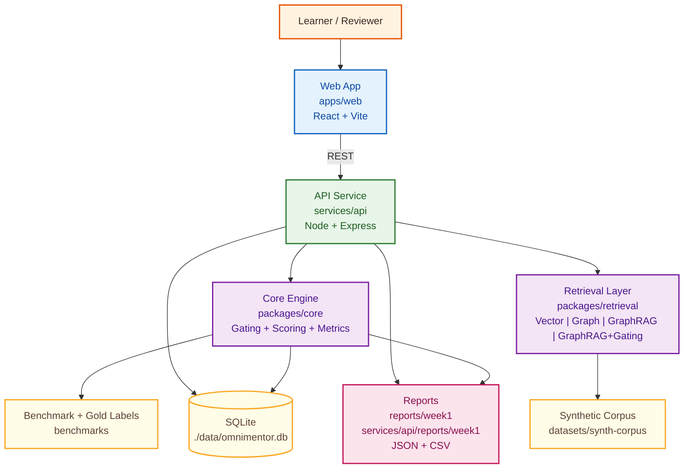
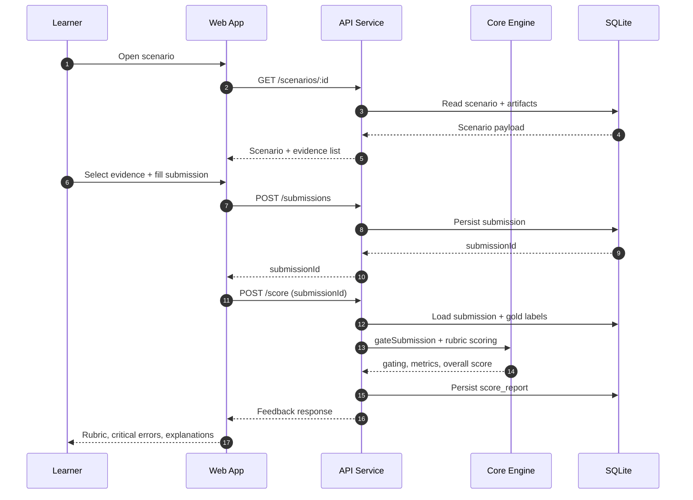
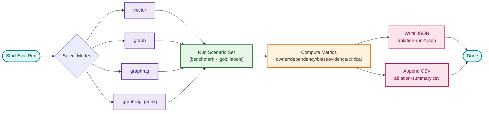

# OmniMentor Architecture

Version: 2.0
Last Updated: 2026-03-07
Scope: Proposal-aligned baseline (Phase 1 complete, Phase 2+ planned)

## 1. Architecture Goals

OmniMentor is designed to support deliberate technical practice through:
- Scenario-based problem solving.
- Evidence-first reasoning and claim validation.
- Rubric-driven scoring with transparent metrics.
- Reproducible evaluation across retrieval strategies.

This architecture follows the project proposal as the baseline. Any future deviations must be documented in local session notes and summarized in weekly check-ins.

## 2. High-Level System Architecture



## 3. Flow A Runtime (Proposal Spine)

Flow A is the primary implementation path for Week 1.



## 4. Evaluation And Ablation Pipeline

This aligns to proposal requirement for mode comparison:
- `vector`
- `graph`
- `graphrag`
- `graphrag_gating`



## 5. Component Responsibilities

### 5.1 Web App (`apps/web`)
- Renders scenario prompts and evidence artifacts.
- Captures structured submission fields.
- Displays score, gating outcome, and rubric feedback.

### 5.2 API Service (`services/api`)
- Exposes REST contracts for scenario/evidence/submission/score/eval.
- Handles validation, persistence, and report generation.
- Coordinates core scoring and retrieval abstractions.

### 5.3 Core Engine (`packages/core`)
- Claim-unit parsing and evidence gating.
- Owner routing, dependency trace, blast radius scoring.
- Rubric construction and aggregate metrics.

### 5.4 Retrieval Layer (`packages/retrieval`)
- Pluggable retrieval interface for ablation modes.
- Baseline/stub in Phase 1, expanded behavior in later phases.

### 5.5 Data And Benchmarks
- Synthetic corpus in `datasets/synth-corpus`.
- Gold labels and benchmark definitions in `benchmarks`.
- Persistent runtime state in SQLite.

## 6. API Contract Summary

- `GET /`
- `GET /health`
- `GET /scenarios`
- `GET /scenarios/:id`
- `GET /evidence?scenarioId=:id`
- `POST /submissions`
- `POST /score`
- `POST /ablation/run`

## 7. Data Model (Logical)

### Scenario
- `id`, `title`, `prompt`, `artifacts[]`

### Submission
- `scenarioId`
- `ownerRouting`
- `dependencyTrace[]` (`from`, `to`, `type`)
- `actionPlan`
- `blastRadius[]`
- `evidenceNotes`
- `selectedEvidenceIds[]`

### Score Report
- `gatingPassed`
- `criticalErrors[]`
- `rubricScores`
- `metrics`
- `goldComparison`

### Ablation Output
- `runId`
- `mode`
- `scenarioId`
- `metrics`
- JSON + CSV artifacts

## 8. Quality And Reproducibility Model

Required command gates:

```bash
pnpm lint
pnpm test
pnpm typecheck
pnpm build
pnpm smoke
pnpm eval
pnpm audit
```

Traceability:
- Session notes kept locally (outside GitHub check-in)
- Reproducible command artifacts under `reports/` and `services/api/reports/`

Runtime artifact evidence:
- `reports/week1/smoke-*.json`
- `services/api/reports/week1/ablation-run-*.json`
- `services/api/reports/week1/ablation-summary.csv`

## 9. Security And Data Constraints

- Synthetic-only educational content.
- No secrets committed (`.env` stays local).
- Input validation and centralized error handling.
- Localhost-scoped CORS and baseline rate limiting.

## 10. Phase Mapping

### Phase 1 (Current)
- Flow A end-to-end path.
- SQLite persistence.
- Evidence gating v1.
- Rubric + metrics + smoke/eval artifacts.

### Phase 2+
- Retrieval-depth behavior and stronger context assembly.
- Expanded benchmark scenarios and robustness tests.
- Incremental integration/E2E hardening.

## 11. Proposal Alignment Statement

This architecture is intentionally proposal-first. If implementation diverges from proposal assumptions, the change process is:
1. Record rationale and impact in local session notes.
2. Preserve verification evidence in generated report artifacts.
3. Disclose deviation in weekly check-in.
