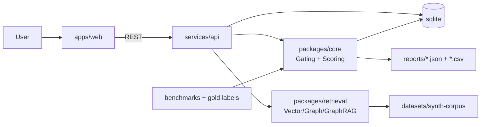

# OmniMentor — Master Instructions (feed to coding agent)
Version: 1.0 (2026-03-07)

## Non‑negotiables (read first)

- **Academic-only repo**: No personal info, no company/internal info, no real logs/data, no secrets. Synthetic-only scenarios/artifacts/benchmarks.
- **Stack (locked)**: TypeScript/Node + React (Vite) + sqlite.
- **Verification gates**: `lint`, `test`, `typecheck`, `smoke` must pass before marking work “done”.
- **No hallucination**: Never claim something exists unless it is implemented and reproducible via commands and/or tests.


## Recommended development method (automation-first, mentor-friendly terminology)
Use **Spec-driven development + contract-first + test pyramid (automation-first)**:
- **Spec-driven**: Treat the proposal + `docs/architecture.md` + API contracts + rubric/gating rules as the source of truth; update specs first when behavior changes.
- **Contract-first**: Define stable TypeScript interfaces and API schemas (OpenAPI optional) before implementation; write tests against the contracts.
- **Test pyramid**:
  - Many fast **unit tests** (gating/scoring/metrics)
  - Some **integration tests** (API + sqlite, deterministic datasets)
  - Few high-value **E2E tests** (Flow A golden path) with Playwright
- **Trunk-based with small commits**: keep main branch green; each change extends automation when it changes behavior.

Why this fits OmniMentor:
- Core correctness is in **gating/scoring/benchmark** (best validated by unit/contract tests).
- UI and retrieval plumbing evolve—E2E is valuable but should be **minimal and resilient** (test user-visible behavior, not implementation details).

## Continuity across sessions (MANDATORY)
Because a new chat may lose state, create and maintain **one** context file:
- Create: `PROJECT_CONTEXT.md`
- At the **start of every session**: read `PROJECT_CONTEXT.md` and restate: current phase + next 3 tasks.
- At the **end of every session**: update it with:
  - What changed (features/files/schemas)
  - How to run/verify (exact commands)
  - Evidence anchors (commit SHAs, report file paths)
  - Open risks/issues + next steps

## Project mission (proposal fidelity)
Build **OmniMentor**: a scenario-based onboarding deliberate-practice app with an evidence-first workflow and rubric-based scoring, evaluated using a gold-labeled benchmark and ablation study across:
1) Vector-only retrieval
2) Graph-only retrieval
3) GraphRAG (graph + retrieval context assembly)
4) GraphRAG + evidence gating (claim-level evidence required)

Local-first on a Mac. Reproducible benchmark runs. Evaluation-first engineering.

## Documentation rule (keep repo low-noise; mentor-friendly)
- The `/docs` directory MUST contain **only one file**: `docs/architecture.md`.
- Put everything else in the root `README.md` (run steps, verification gates, privacy/safety rules, benchmark/eval commands, and roadmap).
- Do NOT create additional markdown files under `/docs`.

## Required repo layout (create exactly)
```
/apps/web                  # React UI
/services/api              # Node API (REST)
/packages/core             # types, scoring, gating, rubric, schemas
/packages/retrieval        # retrieval modes + interfaces
/datasets/synth-corpus     # synthetic artifacts + graph nodes/edges (versioned)
/benchmarks                # scenarios + gold labels
/reports                   # generated outputs (gitignore most; keep tiny sample if needed)
/deploy/local              # local deploy assets (helm + scripts placeholders OK in Phase 1)
/deploy/enterprise         # enterprise overlay ONLY; never referenced in /docs
/docs                      # MUST contain only architecture.md
/scripts                   # smoke + eval runner scripts
```

## Required “important files” to create
Create these files (with meaningful content, not placeholders):
- `README.md` — local run instructions + smoke/eval commands
- `docs/architecture.md` — **architecture diagram** + explanation (see below)
- `PROJECT_CONTEXT.md` — living context (see continuity rules)
- `.env.example` — no secrets; only defaults/placeholders
- `.gitignore` — exclude `.env`, db files, logs, raw reports, OS files
- `.github/workflows/ci.yml` — lint/test/typecheck/build + basic secret scan + `pnpm audit` baseline

### Architecture diagram requirement (`docs/architecture.md`)
Create a detailed architecture document containing:
- A **Mermaid** diagram (preferred) of modules and data flow.
- Include layers: UI, API, Core (gating/scoring), Retrieval modes, Benchmark harness, sqlite persistence.
- Show Flow A and where evidence gating + scoring happen.
- Example Mermaid block to include (tailor it to actual code):


## Functional requirements (must implement)
### Flow A (Phase 1 spine; demoable early)
Scenario prompt → evidence panel (open artifacts; mark **primary/corroborating**) → structured submission:
- owner routing
- dependency trace (**directed upstream → downstream**)
- action plan + blast radius
- evidence notes
→ feedback: rubric score + critical error flags + gold-aligned explanations.

### Flow B (later)
Start from a domain map node → inspect neighbors → choose linked scenario → proceed like Flow A.

## Evidence gating (explicit + testable)
- Split the response into **claim-units** (sentence-level is acceptable).
- A claim is supported only if it cites opened evidence satisfying policy (primary/corroborating) OR matches the gold evidence set.
- Unsupported claims trigger critical errors and reduce score.
Implement gating as a standalone module with unit tests.

## Benchmark + evaluation (required)
- Implement benchmark structure for **12 scenarios** (Phase 1: scaffold with 1 scenario).
- Each scenario has gold labels:
  - goldOwner
  - goldDependencyTrace (directed)
  - goldSafeActions
  - goldRequiredEvidenceIds
- Minimum metrics:
  - owner routing accuracy
  - dependency trace accuracy (directionality)
  - blast radius completeness/quality
  - evidence relevance
  - unsupported-claim rate
  - critical error rate
- Every mode outputs:
  - JSON report (machine-readable)
  - CSV summary row (for ablation tables)

## Interfaces (implement before advanced retrieval)
Create typed interfaces (TS) for:
- `Retriever`
- `ContextBuilder` (GraphRAG-ish)
- `GatingPolicy`
- `Scorer`
- `AblationRunner`

## API contract (minimum endpoints)
- `GET /health`
- `GET /scenarios`
- `GET /scenarios/:id`
- `GET /evidence?scenarioId=:id` (stub in Phase 1; real retrieval later)
- `POST /submissions` (persist submission)
- `POST /score` (gating + rubric + metrics; persist report)
- `POST /ablation/run` (run benchmark across modes; output reports)

## Security defaults (must in Phase 1)
- Input validation on POST bodies (schema validation)
- Baseline security headers
- CORS restricted to localhost
- Basic rate limiting
- Centralized error handler; avoid leaking stack traces in non-dev responses


## Phase-gate automation (minimal, high-ROI) — REQUIRED IN REPO
Automation exists to prevent regressions as retrieval variants and the benchmark harness evolve. Keep it small and deterministic.
Implement a **phase-gate test suite** that grows only as needed to validate each phase.

### Phase 1 gate (required)
- **Unit tests** (fast): claim-unit parsing, evidence gating, scoring/rubric, metrics aggregation
- **Integration test** (API + sqlite): health → scenarios → submissions → score; assert sqlite rows + report file created
- **Smoke command**: `pnpm smoke` runs one scenario end-to-end and writes a report under `reports/`

### Phase 2+ gates (add only what’s needed)
- Vector baseline: deterministic retrieval candidates + benchmark run produces JSON + CSV row
- Graph baseline: bounded exploration behavior + benchmark run row
- GraphRAG: context builder behavior + ablation output row
- GraphRAG+gating: regression tests for gating correctness on at least one scenario

### E2E (UI) tests (optional; add after UI stabilizes)
Add **one** Flow A golden-path E2E test only after the UI structure is stable to avoid brittle tests in early phases.

### CI (optional early; recommended once Phase 1 is stable)
CI should run lint + unit tests + typecheck + build + smoke. Add integration/E2E to CI once they are stable.


## Verification log (required)
Create and maintain `VERIFICATION_LOG.md` at the repo root. After each work session, append:
- date/time
- commands run
- observed results
- smoke output filename
- report paths

## Phase plan (follow school schedule)
### Phase 1 (Week 1)
- Repo scaffold + key docs
- Flow A spine end-to-end for **1 scenario**
- sqlite persistence
- evidence gating v1 + scoring + unit tests
- benchmark scaffold (1 scenario + gold labels)
- `scripts/smoke` end-to-end; `scripts/eval_run` scaffolding
- CI green

Stop after Phase 1 is complete and smoke/tests/CI are green.
